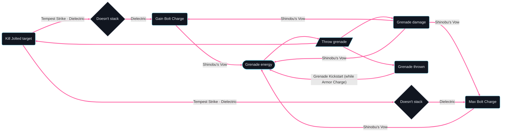

# Skip Grenade Hunter (Ascension) — loop graph

Generated by `loopsmith graph builds/skip-grenade-hunter-ascension/build.yaml --loops-only --limit 6` and `loopsmith loops builds/skip-grenade-hunter-ascension/build.yaml --limit 6`.
How to read it (thick edges, labels, the "Doesn't stack" rhombuses): the
[parent build's loop graph](../skip-grenade-hunter/loop-graph.md).

The loops are the parent's, all 26 of them: Flow State and Ascension both give Amplified and refund no
ability energy, so swapping one for the other changes no energy loop. Ascension's trigger, "Class
ability in the air" (`class:air`), shows in the full graph (`graph` without `--loops-only`): "Use class
ability" reaches it, and its Jolt is what "Kill Jolted target" needs (a dotted link), but it closes no
loop. What the air move adds shows in a designed loop instead:
[loops/helicopter-skip-grenades.loop.yaml](loops/helicopter-skip-grenades.loop.yaml).



```text
26 loops found (showing 6; --limit to change)
Loop 1 · ability loop — refunds grenade energy · 3 steps
  Throw grenade → Grenade damage →[Shinobu's Vow] Grenade energy → ↺
Loop 2 · ability loop — refunds grenade energy · 3 steps
  Throw grenade → Grenade thrown →[Grenade Kickstart (while Armor Charge)] Grenade energy → ↺
Loop 3 · ability loop — refunds grenade energy · 4 steps
  Throw grenade → Grenade damage →[Shinobu's Vow] Gain Bolt Charge →[Shinobu's Vow] Grenade energy → ↺
Loop 4 · ability loop — refunds grenade energy · 4 steps
  Throw grenade → Grenade damage →[Shinobu's Vow] Max Bolt Charge →[Shinobu's Vow] Grenade energy → ↺
Loop 5 · ability loop — refunds grenade energy · 4 steps
  Throw grenade → Kill Jolted target →[Tempest Strike, Dielectric] Doesn't stack →[Dielectric] Gain Bolt Charge →[Shinobu's Vow] Grenade energy → ↺
Loop 6 · ability loop — refunds grenade energy · 4 steps
  Throw grenade → Kill Jolted target →[Tempest Strike, Dielectric] Doesn't stack →[Dielectric] Max Bolt Charge →[Shinobu's Vow] Grenade energy → ↺
```
