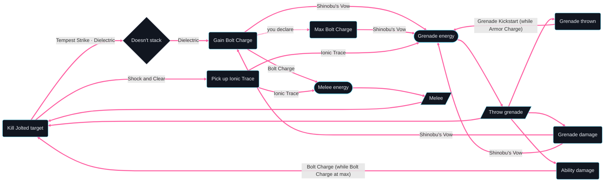

# Skip Grenade Hunter (Ascension) — loop graph

Generated by `loopsmith graph builds/skip-grenade-hunter-ascension/build.yaml --loops-only --limit 10` and `loopsmith loops builds/skip-grenade-hunter-ascension/build.yaml --limit 10`.
How to read it — thick edges, labels, the dotted "you declare" edge to Max Bolt Charge
([ADRs D3](../../ADRs.md#d3--the-player-declares-thresholds-and-endings)) and the "Doesn't stack"
rhombus ([ADRs D6](../../ADRs.md#d6--rules-that-dont-stack-give-way-and-show-as-wasted)): the
[parent build's loop graph](../skip-grenade-hunter/loop-graph.md).

The loops are the parent's, all 32 of them: Flow State and Ascension both give Amplified and give no
ability energy back, so swapping one for the other changes no energy loop. Ascension's trigger, "Class
ability in the air" (`class:air`), shows in the full graph (`graph` without `--loops-only`): "Use class
ability" reaches it, and its Jolt is what "Kill Jolted target" needs (a dotted link), but it closes no
loop. What the air move adds shows in a designed loop instead:
[loops/helicopter-skip-grenades.loop.yaml](loops/helicopter-skip-grenades.loop.yaml).



```text
32 loops found (showing 10; --limit to change)
Loop 1 · ability loop — gives grenade energy back · 3 steps
  Throw grenade → Grenade damage →[Shinobu's Vow] Grenade energy → ↺
Loop 2 · ability loop — gives grenade energy back · 3 steps
  Throw grenade → Grenade thrown →[Grenade Kickstart (while Armor Charge)] Grenade energy → ↺
Loop 3 · ability loop — gives grenade energy back · 4 steps
  Throw grenade → Grenade damage →[Shinobu's Vow] Gain Bolt Charge →[Shinobu's Vow] Grenade energy → ↺
Loop 4 · ability loop — gives grenade energy back · 4 steps
  Throw grenade → Kill Jolted target →[Tempest Strike, Dielectric] Doesn't stack →[Dielectric] Gain Bolt Charge →[Shinobu's Vow] Grenade energy → ↺
Loop 5 · ability loop — gives grenade energy back · 4 steps
  Throw grenade → Kill Jolted target →[Shock and Clear] Pick up Ionic Trace →[Ionic Trace] Grenade energy → ↺
Loop 6 · ability loop — gives melee energy back · 4 steps
  Melee → Kill Jolted target →[Tempest Strike, Dielectric] Doesn't stack →[Dielectric] Gain Bolt Charge →[Bolt Charge] Melee energy → ↺
Loop 7 · ability loop — gives melee energy back · 4 steps
  Melee → Kill Jolted target →[Shock and Clear] Pick up Ionic Trace →[Ionic Trace] Melee energy → ↺
Loop 8 · ability loop — gives grenade energy back · 5 steps
  Throw grenade → Ability damage →[Bolt Charge (while Bolt Charge at max)] Kill Jolted target →[Tempest Strike, Dielectric] Doesn't stack →[Dielectric] Gain Bolt Charge →[Shinobu's Vow] Grenade energy → ↺
Loop 9 · ability loop — gives grenade energy back · 5 steps
  Throw grenade → Ability damage →[Bolt Charge (while Bolt Charge at max)] Kill Jolted target →[Shock and Clear] Pick up Ionic Trace →[Ionic Trace] Grenade energy → ↺
Loop 10 · ability loop — gives grenade energy back · 5 steps
  Throw grenade → Grenade damage →[Shinobu's Vow] Gain Bolt Charge →[you declare] Max Bolt Charge →[Shinobu's Vow] Grenade energy → ↺
```
