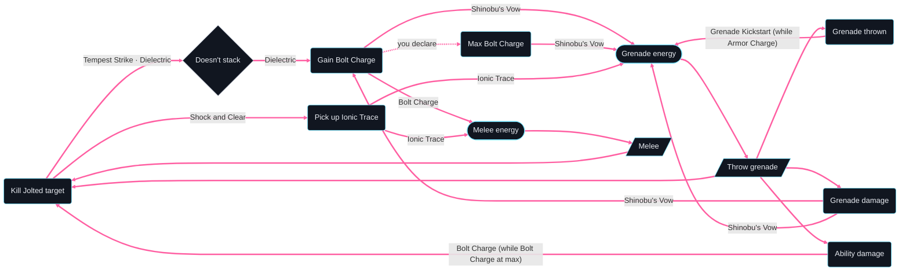

# Skip Grenade Hunter — loop graph

Generated by `loopsmith graph builds/skip-grenade-hunter/build.yaml --loops-only --limit 10` and `loopsmith loops builds/skip-grenade-hunter/build.yaml --limit 10`.
With `--loops-only` every edge shown is a loop step, drawn thick and pink: the unlabelled ones are
things you do (spend the grenade or melee energy, throw, melee), the labelled ones name the elements
behind them, with their guard when they have one: "Bolt Charge (while Bolt Charge at max)" is the
lightning strike on the next ability hit once you have declared Bolt Charge at max. (Without
`--loops-only`, things you do that aren't on a loop are dotted, and so are the "needs" links — a debuff
a trigger requires, the declared max a guard reads — labelled with their element.)

The dotted edge labelled "you declare", Gain Bolt Charge → Max Bolt Charge, is the player's call
([ADRs D3](../../ADRs.md#d3--the-player-declares-thresholds-and-endings)): a grant ("+1 Bolt Charge")
leads only to "Gain Bolt Charge", and Bolt Charge is at its max when you declare it
(`max:bolt-charge` in a designed loop). It is a loop step like the things you do — loop 10 counts
5 steps — and on a loop it is dotted, thick and pink.

The rhombus is a "Doesn't stack" node
([ADRs D6](../../ADRs.md#d6--rules-that-dont-stack-give-way-and-show-as-wasted)). On a jolted kill,
Tempest Strike's Bolt Charge doesn't stack with Dielectric's (discrepancies row 26): both rules' arrows
go into the node and only Dielectric's leaves it, as in the trace, where Tempest Strike's rule gives way
on every jolted kill. The node isn't a step, so loops 4 and 6 count 4 steps
([rule format](../../docs/rule-format.md#rules-that-dont-stack)).



```text
32 loops found (showing 10; --limit to change)
Loop 1 · ability loop — gives grenade energy back · 3 steps
  Throw grenade → Grenade damage →[Shinobu's Vow] Grenade energy → ↺
Loop 2 · ability loop — gives grenade energy back · 3 steps
  Throw grenade → Grenade thrown →[Grenade Kickstart (while Armor Charge)] Grenade energy → ↺
Loop 3 · ability loop — gives grenade energy back · 4 steps
  Throw grenade → Grenade damage →[Shinobu's Vow] Gain Bolt Charge →[Shinobu's Vow] Grenade energy → ↺
Loop 4 · ability loop — gives grenade energy back · 4 steps
  Throw grenade → Kill Jolted target →[Tempest Strike, Dielectric] Doesn't stack →[Dielectric] Gain Bolt Charge →[Shinobu's Vow] Grenade energy → ↺
Loop 5 · ability loop — gives grenade energy back · 4 steps
  Throw grenade → Kill Jolted target →[Shock and Clear] Pick up Ionic Trace →[Ionic Trace] Grenade energy → ↺
Loop 6 · ability loop — gives melee energy back · 4 steps
  Melee → Kill Jolted target →[Tempest Strike, Dielectric] Doesn't stack →[Dielectric] Gain Bolt Charge →[Bolt Charge] Melee energy → ↺
Loop 7 · ability loop — gives melee energy back · 4 steps
  Melee → Kill Jolted target →[Shock and Clear] Pick up Ionic Trace →[Ionic Trace] Melee energy → ↺
Loop 8 · ability loop — gives grenade energy back · 5 steps
  Throw grenade → Ability damage →[Bolt Charge (while Bolt Charge at max)] Kill Jolted target →[Tempest Strike, Dielectric] Doesn't stack →[Dielectric] Gain Bolt Charge →[Shinobu's Vow] Grenade energy → ↺
Loop 9 · ability loop — gives grenade energy back · 5 steps
  Throw grenade → Ability damage →[Bolt Charge (while Bolt Charge at max)] Kill Jolted target →[Shock and Clear] Pick up Ionic Trace →[Ionic Trace] Grenade energy → ↺
Loop 10 · ability loop — gives grenade energy back · 5 steps
  Throw grenade → Grenade damage →[Shinobu's Vow] Gain Bolt Charge →[you declare] Max Bolt Charge →[Shinobu's Vow] Grenade energy → ↺
```
