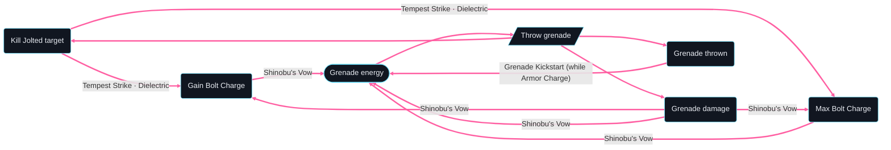

# Skip Grenade Hunter — loop graph

Generated by `loopsmith graph builds/skip-grenade-hunter/build.yaml --loops-only --limit 6` and `loopsmith loops builds/skip-grenade-hunter/build.yaml --limit 6`.
With `--loops-only` every edge shown is a loop step, so all of them are thick and pink: the unlabelled
ones are things you do (spend the grenade energy, throw), the labelled ones name the elements behind
them. (Without `--loops-only`, things you do that aren't on a loop, and "applies a debuff that trigger
needs" links, are dotted.)

The graph credits "Kill Jolted target → Gain Bolt Charge / Max Bolt Charge" to both Tempest Strike and
Dielectric. In the trace, Tempest Strike's Bolt Charge gives way to Dielectric's on every jolted kill
(they don't stack, discrepancies row 26), so with this build those edges come from Dielectric alone.



```text
26 loops found (showing 6; --limit to change)
Loop 1 · ability loop — refunds grenade energy · 3 steps
  Throw grenade → Grenade damage →[Shinobu's Vow] Grenade energy → ↺
Loop 2 · ability loop — refunds grenade energy · 3 steps
  Throw grenade → Grenade thrown →[Grenade Kickstart (while Armor Charge)] Grenade energy → ↺
Loop 3 · ability loop — refunds grenade energy · 4 steps
  Throw grenade → Grenade damage →[Shinobu's Vow] Gain Bolt Charge →[Shinobu's Vow] Grenade energy → ↺
Loop 4 · ability loop — refunds grenade energy · 4 steps
  Throw grenade → Grenade damage →[Shinobu's Vow] Max Bolt Charge →[Shinobu's Vow] Grenade energy → ↺
Loop 5 · ability loop — refunds grenade energy · 4 steps
  Throw grenade → Kill Jolted target →[Tempest Strike, Dielectric] Gain Bolt Charge →[Shinobu's Vow] Grenade energy → ↺
Loop 6 · ability loop — refunds grenade energy · 4 steps
  Throw grenade → Kill Jolted target →[Tempest Strike, Dielectric] Max Bolt Charge →[Shinobu's Vow] Grenade energy → ↺
```
